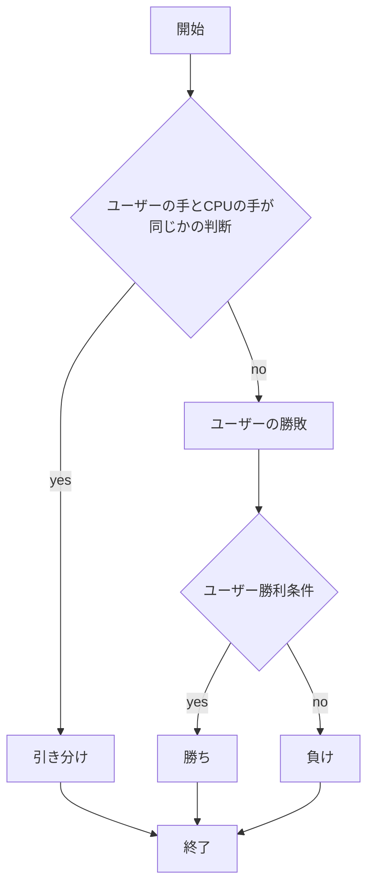
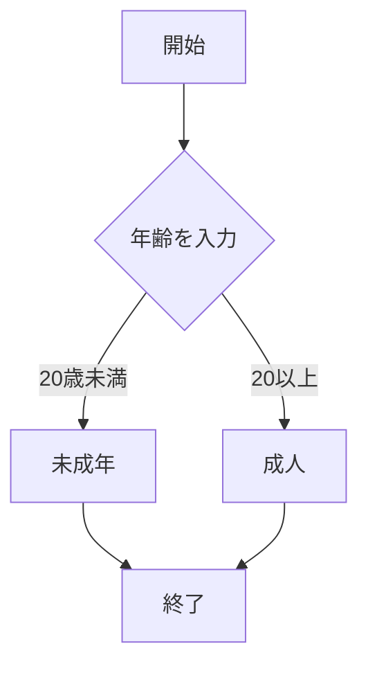
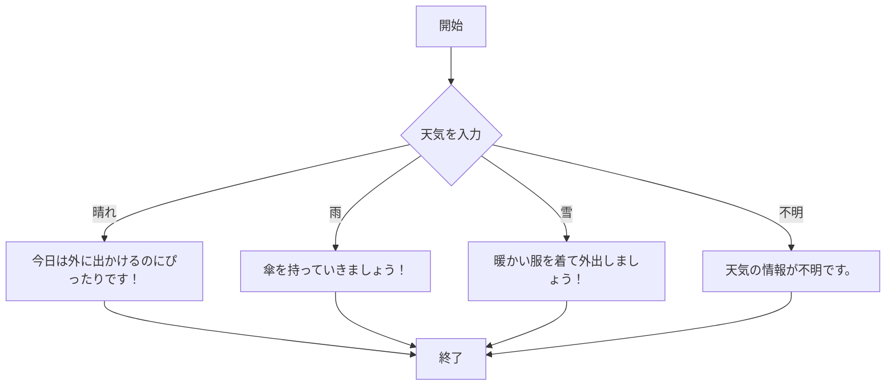

# webpro_06

## このプログラムについて

## ファイル一覧
ファイル名 | 説明
-|-
app5.js | プログラム本体
public/show.html| Hollo world・Bon jourを出力する
public/luck.html| 今日の運勢を占う
public/icon.html| アイコンを表示する
public/janken.html| じゃんけんの勝ち負けを判定する
public/age.html | 年齢で成人か未成年かを区別する
public/weather.html | 天気によっての行動を判定する

## show
##　起動方法
1.```node app5.js```でプログラムを起動する
2.Webブラウザで```localhost:8080/public/hello1```か```localhost:8080/public/hello2```にアクセスする
3. 自分の手を入力する
4.Hello world・Bon jourを出力される
## luck
##　起動方法
1.```node app5.js```でプログラムを起動する
2.Webブラウザで```localhost:8080/public/luck.html```にアクセスする
3. 自分の手を入力する
4.大吉・中吉が出力される


## icon
##　起動方法
1.```node app5.js```でプログラムを起動する
2.Webブラウザで```localhost:8080/public/icon.html```にアクセスする
3. 自分の手を入力する
4.設定している画像が出力される


## janken
##　起動方法
1.```node app5.js```でプログラムを起動する
2.Webブラウザで```localhost:8080/public/janken.html```にアクセスする
3. 自分の手を入力する
4.グー・チョキ・パーを選択する
5.勝ち・負け・引き分けのどれか一つが出力される



## age
##　起動方法
1.```node app5.js```でプログラムを起動する
2.Webブラウザで```localhost:8080/public/age.html```にアクセスする
3. 自分の手を入力する
4.年齢をいれる欄に年齢を入力
5.送信すると18歳以上で「成人」18歳未満で「未成年」と出力される




## weather
##　起動方法

1.```node app5.js```でプログラムを起動する
2.Webブラウザで```localhost:8080/public/age.html```にアクセスする
3. 自分の手を入力する
4.今日の天気のチェックボックスをクリック
5.送信を押す
6.天気によっての行動が出力される


