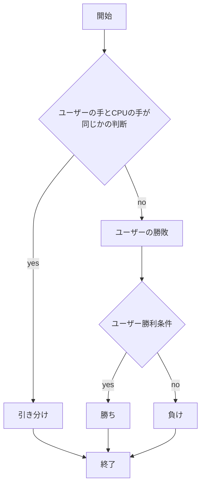
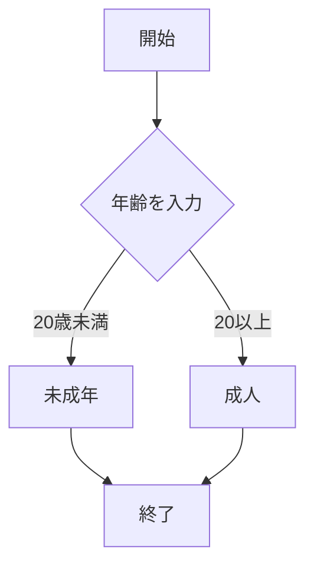
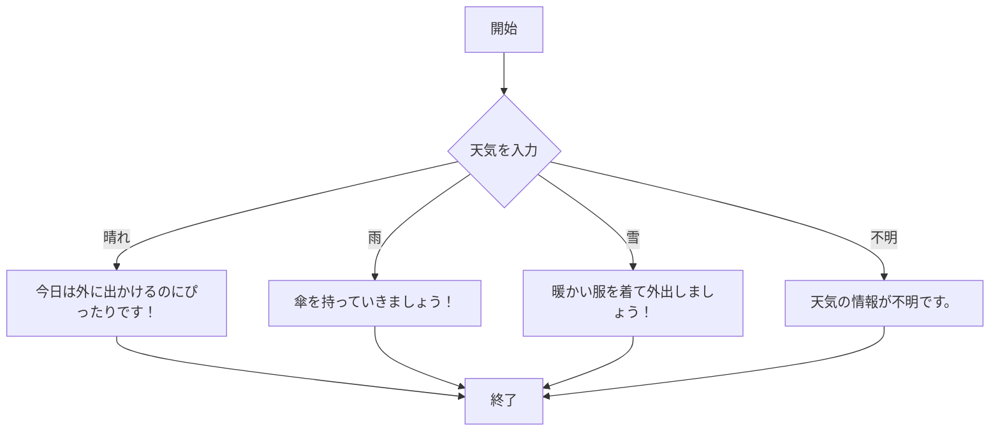

# webpro_06

## このプログラムについて

## ファイル一覧
ファイル名 | 説明
-|-
app5.js | プログラム本体
public/show.html| Hollo world・Bon jourを出力する
public/luck.html| 今日の運勢を占う
public/icon.html| アイコンを表示する
public/janken.html| じゃんけんの勝ち負けを判定する
public/age.html | 年齢で成人か未成年かを区別する
public/weather.html | 天気によっての行動を判定する

## show
##　起動方法
1.```node app5.js```でプログラムを起動する
2.Webブラウザで```localhost:8080/public/hello1```か```localhost:8080/public/hello2```にアクセスする
3. 自分の手を入力する
4.Hello world・Bon jourを出力される

```javascript

app.get("/hello1", (req, res) => {
  const message1 = "Hello world";
  const message2 = "Bon jour";
  res.render('show', { greet1:message1, greet2:message2});
  });
```
## luck
##　起動方法
1.```node app5.js```でプログラムを起動する
2.Webブラウザで```localhost:8080/public/luck.html```にアクセスする
3. 自分の手を入力する
4.大吉・中吉が出力される


```javascript

app.get("/luck", (req, res) => {
  const num = Math.floor( Math.random() * 6 + 1 );
  let luck = '';
  if( num==1 ) luck = '大吉';
  else if( num　<=2 ) luck = '中吉';
  console.log( 'あなたの運勢は' + luck + 'です' );
  res.render( 'luck', {number:num, luck:luck} );
});
```

## icon
##　起動方法
1.```node app5.js```でプログラムを起動する
2.Webブラウザで```localhost:8080/public/icon.html```にアクセスする
3. 自分の手を入力する
4.設定している画像が出力される


```javascript
app.get("/icon", (req, res) => {
  res.render('icon', { filename:"./public/Apple_logo_black.svg", alt:"Apple Logo"});
});
```

## janken
##　起動方法
1.```node app5.js```でプログラムを起動する
2.Webブラウザで```localhost:8080/public/janken.html```にアクセスする
3. 自分の手を入力する
4.グー・チョキ・パーを選択する
5.勝ち・負け・引き分けのどれか一つが出力される

```javascript
app.get("/janken", (req, res) => {
  // ここに勝敗の判定を入れる
  // 今はダミーで人間の勝ちにしておく
  let judgement = '';
  if (hand == cpu) {
    judgement = '引き分け';
  } else if (
    (hand == 'グー' && cpu == 'チョキ')
    (hand == 'チョキ' && cpu == 'パー')
    (hand == 'パー' && cpu == 'グー')
  ) {
    judgement = '勝ち';
    win += 1;
  } else {
    judgement = '負け';
  }

  total += 1;

  const display = {
    your: hand,
    cpu: cpu,
    judgement: judgement,
    win: win,
    total: total
  };

  res.render('janken', display);
});
```


## age
##　起動方法
1.```node app5.js```でプログラムを起動する
2.Webブラウザで```localhost:8080/public/age.html```にアクセスする
3. 自分の手を入力する
4.年齢をいれる欄に年齢を入力
5.送信すると18歳以上で「成人」18歳未満で「未成年」と出力される

```javascript
const express = require("express");
const app = express();

app.set('view engine', 'ejs');
app.use(express.urlencoded({ extended: true }));
app.use("/public", express.static(__dirname + "/public"));

// `/age` ルート（GET）
app.get("/age", (req, res) => {
  res.render("age");
});

// `/age` ルート（POST）
app.post("/age", (req, res) => {
  const age = req.body.age;
  const ageMessage = age >= 18 ? "成人です" : "未成年です";
  res.render("age", { age, ageMessage });
});
```




## weather
##　起動方法

1.```node app5.js```でプログラムを起動する
2.Webブラウザで```localhost:8080/public/age.html```にアクセスする
3. 自分の手を入力する
4.今日の天気のチェックボックスをクリック
5.送信を押す
6.天気によっての行動が出力される

```javascript
const express = require("express");
const app = express();

app.set('view engine', 'ejs');
app.use(express.urlencoded({ extended: true }));
app.use("/public", express.static(__dirname + "/public"));

// `/weather` ルート（GET）
app.get("/weather", (req, res) => {
  res.render("weather");
});

// `/weather` ルート（POST）
app.post("/weather", (req, res) => {
  const weather = req.body.weather;
  let advice = '';

  if (weather === "晴れ") {
    advice = "今日は外に出かけるのにぴったりです！";
  } else if (weather === "雨") {
    advice = "傘を持っていきましょう！";
  } else if (weather === "雪") {
    advice = "暖かい服を着て外出しましょう！";
  } else {
    advice = "天気の情報が不明です。";
  }

  res.render("weather", { weather, advice });
});
```


